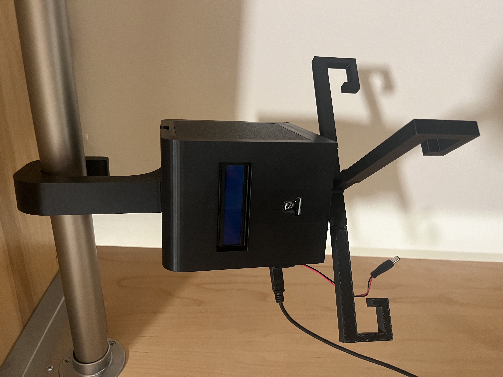
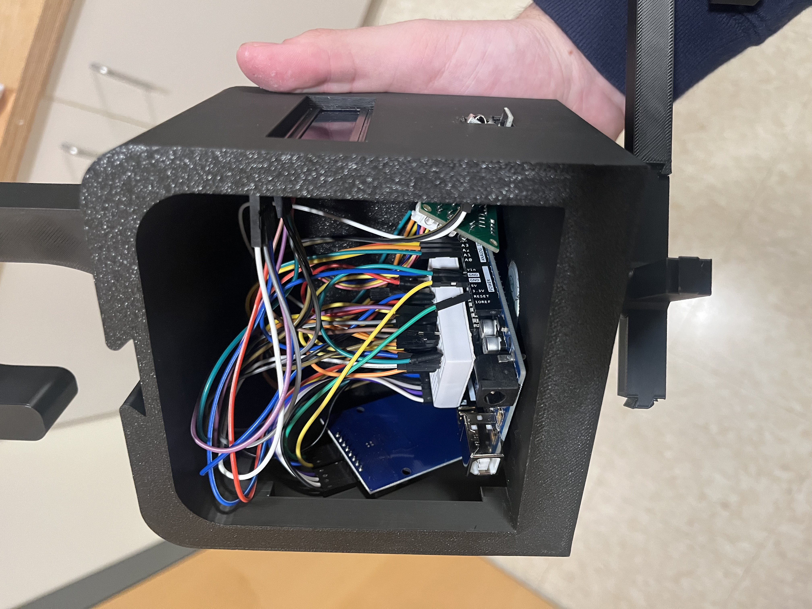
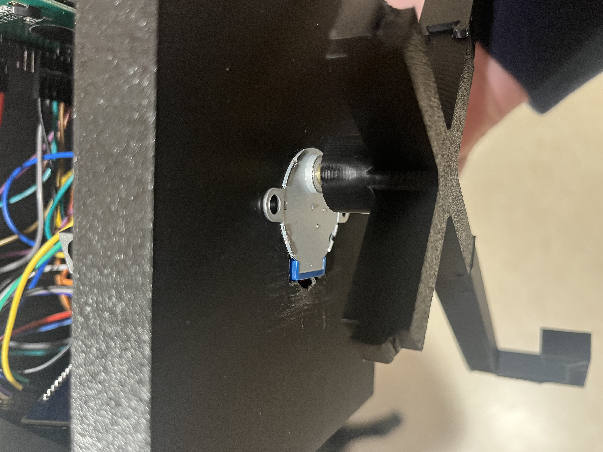

# Arduino-Project
An Arduino-based project integrating an LCD display, stepper motor, RFID authentication, and IR remote control. The system demonstrates secure access with RFID, real-time feedback on an LCD screen, and additional functionality via an IR sensor and remote. I have attached the Arduino IDE code, a solidworks rendering, and a circuit diagram as files, additionally below, are pictures of the arduino system itself, the components, and a short demo of the system

Features

RFID Authentication – Grants access only with a valid RFID tag/card.

LCD Display – Provides real-time feedback and system status.

Stepper Motor Control – The physical actuator that responds to system input.

IR Sensor + Remote – Allows remote input for added control and functionality.

Modular Design – Easy to expand with additional sensors or outputs.

